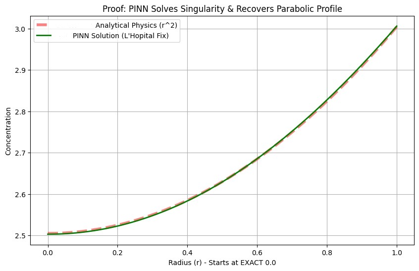

# Spherical Diffusion PINN (Singularity Experiment)

**Author:** Thaer Abushawer

## Motivation
In the Single Particle Model (SPM) for batteries, the diffusion equation is defined in spherical coordinates. A known numerical issue arises at the center (r=0) due to the geometrical term, which often requires mesh refinement in standard solvers.

I wrote this code to test if a **Physics-Informed Neural Network (PINN)** could solve this PDE continuously from r=0 by incorporating the mathematical limit directly into the loss function.

## Mathematical Formulation
The governing PDE for spherical diffusion is:

    ∂C/∂t = D · [ ∂²C/∂r² + (2/r) · ∂C/∂r ]

At the center (r=0), the term (2/r) becomes undefined. I used **L'Hôpital's Rule** to find the limit:

    Limit (r→0):  (2/r) · ∂C/∂r  =  2 · ∂²C/∂r²

Substituting this back, the equation at the center simplifies to:

    ∂C/∂t = 3D · ∂²C/∂r²

## Advanced Implementation Highlights
This repository doesn't just apply a standard PINN; it addresses two major numerical bottlenecks specific to physical simulations in neural networks:

### 1. The Singularity at the Center (Smart Switch)
In standard numerical methods (like Finite Difference), the singularity at `r=0` requires complex mesh refinement. Here, I implemented an **Applied PINN Innovation** using `tf.where`. 
The loss function dynamically switches between the standard spherical PDE and the L'Hôpital's limit exactly at the center. This allows the neural network to learn the continuous domain without encountering `NaN` or `Infinity` losses, effectively replacing adaptive meshing with a purely continuous AI approach.

### 2. Overcoming the "Initial Shock" (Soft-Start Boundary Condition)
A common reason PINNs fail to converge in diffusion problems is the immediate contradiction at `t=0` between the zero initial condition (`C=0`) and a sudden boundary flux (`Flux=1`). 
To ensure stable training, I introduced a **Soft-Start Flux** using `1.0 * tanh(10.0 * t)`. This mathematical trick smooths the transition in the first few milliseconds, preventing numerical shocks and allowing the Adam optimizer to converge smoothly to the correct physical parabolic profile.

## Implementation Details
* **Framework:** DeepXDE / TensorFlow
* **Geometry:** 1D Interval [0, 1] (starting exactly at 0).
* **Logic:** Used `tf.where` to switch between the standard equation (for r > 0) and the L'Hôpital form (for r ≈ 0).

## Results
The model was trained for 10,000 iterations. The plot below compares the PINN prediction against the expected analytical parabolic profile.


*(The Green line represents the PINN solution, showing smooth behavior at the center without numerical artifacts.)*

## Usage
To run the code:

```bash
pip install deepxde
python main.py
